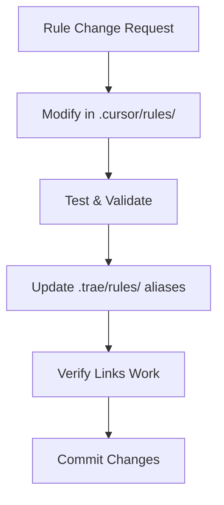

# Trae AI Rules System - Alias & Synchronization Layer

> **🔗 CRITICAL: This directory serves as an ALIAS LAYER ONLY**  
> All actual rules are maintained in `.cursor/rules/` as the PRIMARY SOURCE

## 📋 Directory Purpose

This `.trae/rules/` directory functions as:
- **Alias/Link layer** pointing to actual rules in `.cursor/rules/`
- **Synchronization hub** for Trae AI specific configurations
- **Documentation layer** explaining rule relationships
- **NOT a source of independent rules**

## 🔄 Rules Hierarchy & Priority

```
1. .cursor/rules/     ← PRIMARY SOURCE (Highest Priority)
   ├── All actual rule definitions
   ├── Workflow implementations
   └── Enforcement logic

2. .appdexer/rules/   ← Secondary Reference
   ├── Global project rules
   └── Cross-project standards

3. .trae/rules/       ← Alias Layer (Lowest Priority)
   ├── Alias links to .cursor/rules/
   ├── Synchronization documentation
   └── Trae-specific configurations
```

## 📁 File Structure & Purpose

### Core Files
- **`project_rules.md`** - Main alias file with links to all `.cursor/rules/`
- **`mobile-project-orchestration.md`** - Mobile workflow coordination with aliases
- **`README.md`** - This documentation file

### Alias Link Format
All rules use relative paths to ensure portability:
```markdown
[Rule Name](../../.cursor/rules/rule-file.mdc)
```

## ⚠️ CRITICAL ENFORCEMENT RULES

### Mandatory Compliance
1. **BẮT BUỘC** - All rule modifications MUST be done in `.cursor/rules/` first
2. **NGHIÊM CẤM** - Creating independent rules in `.trae/rules/`
3. **BẮT BUỘC** - Updating alias links when `.cursor/rules/` changes
4. **BẮT BUỘC** - Using relative paths for all links

### Synchronization Protocol


## 🎯 Primary Rules Categories

### Core Development
- [Base Rules](../../.cursor/rules/base-rules.mdc)
- [Development Rules](../../.cursor/rules/development-rules.mdc)
- [Development Control Rules](../../.cursor/rules/development-control-rules.mdc)
- [File Protection Rules](../../.cursor/rules/file-protection-rules.mdc)

### Mobile Development
- [Mobile Utility Workflow](../../.cursor/rules/mobile-utility-workflow.mdc)
- [Android Workflow](../../.cursor/rules/android-workflow.mdc)
- [iOS Workflow](../../.cursor/rules/ios-workflow.mdc)
- [TDD Mobile Workflow](../../.cursor/rules/tdd-mobile-workflow.mdc)

### Project Management
- [Planning Workflow](../../.cursor/rules/planning-workflow.mdc)
- [Planning Enforcement](../../.cursor/rules/planning-enforcement.mdc)
- [Brainstorm Workflow](../../.cursor/rules/brainstorm-workflow.mdc)

### Code Quality
- [Android Code Deduplication](../../.cursor/rules/android-code-deduplication.mdc)
- [Universal Code Deduplication](../../.cursor/rules/universal-code-deduplication.mdc)

## 🚨 Violation Consequences

### If Rules Are Created Independently in .trae/rules/:
- **Immediate synchronization required**
- **Move to .cursor/rules/ and create alias**
- **Update all references**

### If .cursor/rules/ Links Are Broken:
- **Fix relative paths immediately**
- **Verify all aliases work**
- **Test rule accessibility**

## 🔧 Maintenance Commands

### Check All Links
```bash
# Verify all markdown links work
find .trae/rules -name "*.md" -exec grep -l "\[.*\](../../\.cursor/rules/" {} \;
```

### Sync Verification
```bash
# List all .cursor/rules files
ls -la .cursor/rules/

# Check if aliases exist in .trae/rules
grep -r "cursor/rules" .trae/rules/
```

## 📞 Support

For questions about:
- **Rule modifications** → Edit in `.cursor/rules/` first
- **Broken aliases** → Check relative paths
- **New rules** → Create in `.cursor/rules/`, then alias here
- **Synchronization issues** → Follow the protocol above

---

**Remember: This directory is an ALIAS LAYER. All actual rules live in `.cursor/rules/`**