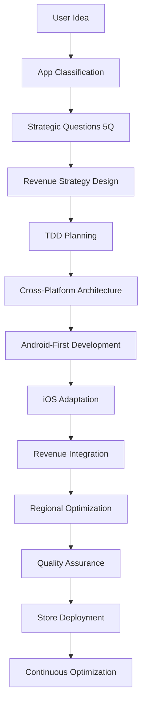

# Mobile Project Orchestration (.trae system)

## Project Lifecycle Orchestration

### Mobile Utility App Pipeline:



## System Integration Coordination

### Workflow Coordination Rules:

```markdown
🔗 MANDATORY .cursor/rules Integration (PRIMARY SOURCE):
✅ [mobile-utility-workflow.mdc](../../.cursor/rules/mobile-utility-workflow.mdc) → Primary workflow controller
✅ [tdd-mobile-workflow.mdc](../../.cursor/rules/tdd-mobile-workflow.mdc) → Test-driven development enforcement
✅ [brainstorm-workflow.mdc](../../.cursor/rules/brainstorm-workflow.mdc) → Enhanced with 5-question limit
✅ [development-control-rules.mdc](../../.cursor/rules/development-control-rules.mdc) → Extended with mobile-specific validations
✅ [planning-workflow.mdc](../../.cursor/rules/planning-workflow.mdc) → Mobile-aware planning procedures
✅ [android-workflow.mdc](../../.cursor/rules/android-workflow.mdc) → Android development workflow
✅ [ios-workflow.mdc](../../.cursor/rules/ios-workflow.mdc) → iOS development workflow
✅ [project-creation-workflow.mdc](../../.cursor/rules/project-creation-workflow.mdc) → Project creation process

📋 Secondary .appdexer/rules Reference:
□ mobile-app-rules.md → App classification and automation
□ project-specific-rules.md → Enhanced with mobile utility patterns
□ global-rules.md → Mobile development standards

🔗 .trae/rules Alias Layer (LOWEST PRIORITY):
□ mobile-project-orchestration.md → This file (coordination controller)
□ project_rules.md → Alias links to .cursor/rules

⚠️ CRITICAL: All workflow execution MUST follow .cursor/rules as PRIMARY SOURCE
```

## Revenue-First Orchestration

### Revenue Strategy Coordination:

```markdown
Phase 1: Revenue Planning (Auto)
□ Detect app category → Apply appropriate revenue model
□ Configure Firebase Remote Config → Regional strategies
□ Setup A/B testing framework → Revenue optimization
□ Design ad placement strategy → Natural breakpoints
□ Plan IAP structure → Premium features identification

Phase 2: Revenue Implementation (Guided)
□ Integrate AdMob SDK → Android + iOS
□ Implement Play Billing → Android subscriptions/purchases
□ Integrate StoreKit 2 → iOS subscriptions/purchases
□ Configure Firebase Analytics → Revenue tracking
□ Setup conversion funnels → Optimization tracking

Phase 3: Revenue Optimization (Continuous)
□ Monitor ARPU/ARPDAU → Per region analysis
□ A/B testing execution → Strategy effectiveness
□ User behavior analysis → Retention vs revenue balance
□ Regional performance → Strategy adjustment
□ Cost optimization → AI API usage vs revenue
```

## TDD Workflow Orchestration

### Test-First Development Coordination:

```markdown
TDD Phase Orchestration:

1. 🔴 RED Phase Coordination:
   □ .cursor/rules/tdd-mobile-workflow.mdc → Generate test specifications
   □ .appdexer/rules/mobile-app-rules.md → Auto-generate test data
   □ Cross-platform test parity → Android + iOS equivalence
   □ Revenue feature testing → Ads + IAP validation
   □ AI integration testing → Fallback scenarios

2. 🟢 GREEN Phase Coordination:
   □ Minimal implementation → Pass failing tests
   □ Platform-specific implementation → Android-first, iOS-second
   □ Revenue integration → Embedded in core features
   □ AI feature implementation → Smart caching included
   □ Cross-platform synchronization → Feature parity maintenance

3. 🔄 REFACTOR Phase Coordination:
   □ Code quality optimization → Performance + maintainability
   □ Test optimization → Coverage + reliability improvement
   □ Architecture refinement → Clean Architecture adherence
   □ Performance tuning → Mobile-specific optimizations
```

## Cross-Platform Development Coordination

### Platform Synchronization Strategy:

```markdown
Android-First Development:
□ Primary implementation → Kotlin + Jetpack Compose
□ Architecture establishment → Clean Architecture + MVVM
□ Core feature development → Complete functionality
□ Testing implementation → Comprehensive test suites
□ Performance optimization → Android-specific tuning
□ Revenue integration → AdMob + Play Billing
□ Store preparation → Play Store submission

iOS Adaptation Process:
□ Architecture translation → Swift + SwiftUI alignment
□ Feature porting → Maintain functionality parity
□ UI/UX adaptation → Human Interface Guidelines
□ Testing adaptation → XCTest + XCUITest equivalent
□ Performance optimization → iOS-specific tuning  
□ Revenue integration → AdMob iOS + StoreKit 2
□ Store preparation → App Store submission

Synchronization Checkpoints:
□ Feature parity validation → Identical functionality
□ UI/UX consistency → Platform-appropriate design
□ Performance parity → Similar performance metrics
□ Revenue strategy alignment → Consistent monetization
□ Analytics synchronization → Unified tracking
□ Testing coverage parity → Equivalent test coverage
```

## AI Integration Orchestration

### Smart AI Development Coordination:

```markdown
AI Feature Development Pipeline:

1. AI Strategy Design:
   □ App category detection → Health/Photo/Office
   □ AI feature identification → Category-specific capabilities
   □ Cost optimization strategy → Batch + cache + predict
   □ Fallback mechanism design → Offline/error scenarios
   □ Performance requirements → Response time + accuracy

2. AI Implementation Coordination:
   □ Cloud API integration → RESTful service connections
   □ Batch processing implementation → 10x efficiency optimization
   □ Local caching system → 80% API call reduction
   □ Smart refresh logic → Weekly/bi-weekly updates
   □ Fallback content system → Offline functionality
   □ Cost tracking implementation → Budget monitoring

3. AI Testing & Validation:
   □ Response accuracy testing → Model validation
   □ Fallback scenario testing → Error handling validation
   □ Performance testing → Response time validation
   □ Cost optimization testing → API usage optimization
   □ Cross-platform testing → Android + iOS consistency
```

## Regional Strategy Orchestration

### Multi-Regional Deployment Coordination:

```markdown
Regional Strategy Implementation:
□ Market classification → High revenue/Premium/Balanced
□ Firebase Remote Config → Regional parameter setup
□ Ad strategy configuration → Market-appropriate approaches
□ A/B testing setup → Regional effectiveness comparison
□ Performance monitoring → Revenue + retention per region
□ Strategy optimization → Data-driven adjustments

Regional Configuration Management:
High Revenue Markets (VN, IN, BR, ID):
□ Aggressive ad placement → Max revenue focus
□ Higher ad frequency → Persistent banners + frequent interstitials
□ Rewarded ads emphasis → Premium feature unlocks
□ Lower UX friction tolerance → Revenue prioritization

Premium Markets (US, JP, DE, UK):
□ Minimal ad placement → IAP conversion focus
□ Strategic friction points → Push subscription upgrades
□ Premium feature previews → Rewarded ad usage
□ High UX quality → Retention prioritization

Balanced Markets (EU, CA, AU, KR):
□ Moderate ad placement → Retention-revenue balance
□ Contextual ad timing → Natural breakpoints only
□ User-initiated rewards → Voluntary engagement
□ Long-term optimization → Sustainable growth focus
```

## Quality Assurance Orchestration

### Comprehensive QA Coordination:

```markdown
Quality Gates Enforcement:
□ Pre-commit validation → All tests passing + coverage thresholds
□ Integration testing → Cross-platform feature parity
□ Performance validation → Benchmarks met on both platforms
□ Security testing → Vulnerability scanning + compliance
□ Accessibility testing → Platform accessibility standards
□ Revenue testing → Ads + IAP functionality validation
□ Regional testing → Strategy effectiveness per market

Quality Metrics Monitoring:
□ Test coverage tracking → Unit/Integration/UI coverage
□ Performance benchmarks → Startup time/responsiveness/memory
□ Crash rate monitoring → < 1% crash rate maintenance
□ User satisfaction → App store ratings + feedback analysis
□ Revenue performance → ARPU/ARPDAU/LTV tracking per region
□ Feature adoption → Usage analytics per feature per platform
```

## Deployment Orchestration

### Multi-Platform Release Coordination:

```markdown
Release Pipeline Coordination:

1. Pre-Release Validation:
   □ Cross-platform feature parity → Identical functionality
   □ Performance benchmarks → Met on both platforms
   □ Revenue functionality → Ads + IAP working correctly
   □ Regional configuration → All markets properly configured
   □ Security compliance → Vulnerability scans completed
   □ Store guidelines → Platform-specific compliance validated

2. Store Submission Coordination:
   □ Play Store submission → Android release preparation
   □ App Store submission → iOS release preparation
   □ Asset synchronization → Consistent branding + screenshots
   □ Description alignment → Platform-appropriate descriptions
   □ Keyword optimization → ASO strategy per platform
   □ Release timing → Coordinated launch strategy

3. Post-Release Monitoring:
   □ Performance monitoring → Real-world performance validation
   □ Crash reporting → Immediate issue identification
   □ Revenue tracking → Live monetization performance
   □ User feedback → App store review monitoring
   □ Feature usage → Analytics validation
   □ Regional performance → Strategy effectiveness validation
```

## Continuous Optimization Orchestration

### Ongoing Development Coordination:

```markdown
Optimization Cycle Management:
Weekly Optimization Tasks:
□ Revenue performance analysis → ARPU/ARPDAU trends per region
□ A/B testing evaluation → Strategy effectiveness comparison
□ User feedback analysis → App store reviews + support tickets
□ AI API cost monitoring → Usage vs revenue optimization
□ Performance monitoring → Benchmark maintenance
□ Cross-platform sync → Feature parity maintenance

Monthly Optimization Tasks:
□ Regional strategy evaluation → Market performance analysis
□ Feature adoption analysis → Usage patterns + optimization opportunities
□ Technical debt assessment → Code quality + architecture review
□ Security updates → Vulnerability patching + compliance updates
□ Competitive analysis → Market position + feature gap analysis
□ User retention analysis → Churn prevention + engagement optimization

Quarterly Strategic Reviews:
□ Revenue model evolution → Monetization strategy optimization
□ Platform strategy review → Android vs iOS focus adjustment
□ AI integration enhancement → New capabilities + cost optimization
□ Regional expansion → New market opportunities
□ Technology stack updates → Framework + dependency updates
□ Long-term roadmap → Feature planning + strategic direction
```

## Emergency Response Orchestration

### Crisis Management Coordination:

```markdown
Emergency Response Procedures:
Critical Issues (Crashes, Security, Revenue Loss):
□ Immediate assessment → Impact scope + severity determination
□ Cross-platform impact → Android + iOS issue coordination
□ Hotfix deployment → Emergency release preparation
□ User communication → Transparent issue acknowledgment
□ Performance restoration → Service level restoration
□ Post-mortem analysis → Root cause + prevention measures

Revenue Performance Issues:
□ Regional analysis → Market-specific performance evaluation
□ Strategy adjustment → A/B testing + configuration changes
□ User behavior analysis → Retention vs revenue impact assessment
□ Competitive response → Market dynamic consideration
□ Long-term optimization → Sustainable revenue strategy adjustment

Technical Performance Issues:
□ Performance profiling → Bottleneck identification
□ Cross-platform coordination → Platform-specific optimization
□ User impact assessment → Affected user segment analysis
□ Optimization prioritization → High-impact improvement focus
□ Validation testing → Performance improvement verification
```
