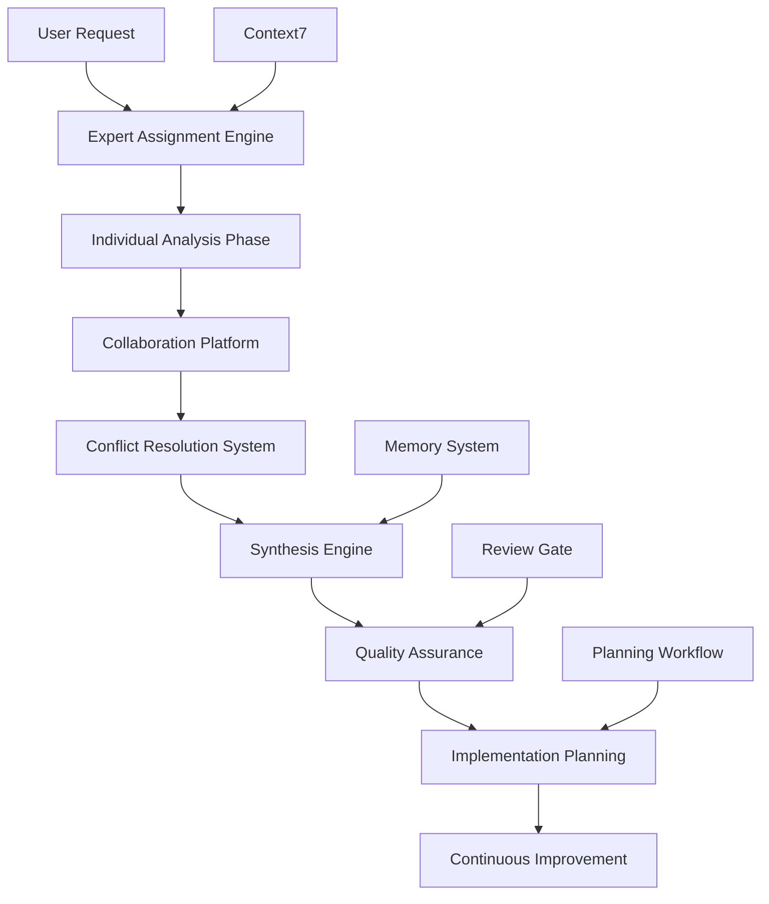

# Implementation Plan: Expert Brainstorm Process Enhancement

## 📋 Project Overview
- **Project Name**: Expert Brainstorm Process Enhancement
- **Implementation Timeline**: 4 weeks
- **Team Size**: 1 Lead + 3-5 Domain Experts
- **Budget Estimate**: Medium
- **Risk Level**: Medium-High

## 🎯 Implementation Phases

### Phase 1: Foundation Setup (Week 1-2)

#### 1.1 Expert Role Definition System
```markdown
# Expert Roles Template

## Technical Architect
**Responsibilities:**
- Assess technical feasibility
- Design system architecture
- Identify technical risks
- Recommend technology stack
- Estimate development effort

**Deliverables:**
- Technical feasibility report
- Architecture diagram
- Technology recommendations
- Risk assessment matrix
- Development timeline estimate

**Expertise Criteria:**
- 5+ years software architecture experience
- Proficiency in target technology stack
- Track record of successful project delivery
- Strong problem-solving skills
```

#### 1.2 Collaboration Protocol Framework
```markdown
# Collaboration Protocols

## Meeting Structure
### Kickoff Meeting (2 hours)
- Problem statement presentation
- Expert role assignments
- Timeline và deliverable agreement
- Communication channel setup

### Individual Analysis Phase (3-5 days)
- Independent research và analysis
- Domain-specific insight gathering
- Initial recommendation drafting
- Assumption documentation

### Collaborative Sessions (4-6 hours total)
- Round 1: Perspective sharing (90 min)
- Round 2: Cross-domain questioning (90 min)
- Round 3: Synthesis và consensus (120 min)

### Follow-up Sessions (As needed)
- Conflict resolution meetings
- Deep-dive technical sessions
- Stakeholder validation meetings
```

#### 1.3 Conflict Resolution Framework
```markdown
# Conflict Resolution Process

## Step 1: Conflict Identification
- Document conflicting viewpoints
- Categorize conflict type
- Assess impact level
- Assign resolution priority

## Step 2: Evidence Gathering
- Request supporting data
- Conduct additional research
- Gather stakeholder input
- Create comparison matrix

## Step 3: Structured Debate
- Present arguments (10 min each side)
- Q&A session (15 min)
- Neutral expert input (10 min)
- Group discussion (20 min)

## Step 4: Decision Making
- Apply decision framework
- Vote if necessary
- Document rationale
- Plan implementation
```

### Phase 2: Tool Integration (Week 2-3)

#### 2.1 Digital Collaboration Platform Setup
```yaml
# Platform Requirements
Core Features:
  - Real-time document collaboration
  - Video conferencing integration
  - Task và timeline management
  - Version control for documents
  - Expert profile management

Integrations:
  - Slack/Teams for communication
  - Google Workspace/Office 365
  - Project management tools
  - Calendar scheduling
  - File storage systems

Security:
  - End-to-end encryption
  - Access control management
  - Audit trail logging
  - Data backup và recovery
```

#### 2.2 AI-Powered Synthesis Engine
```python
# Synthesis Algorithm Framework
class ExpertSynthesisEngine:
    def __init__(self):
        self.expert_inputs = []
        self.conflict_detector = ConflictDetector()
        self.pattern_analyzer = PatternAnalyzer()
        self.recommendation_generator = RecommendationGenerator()
    
    def process_expert_inputs(self, inputs):
        # Aggregate expert perspectives
        aggregated_data = self.aggregate_perspectives(inputs)
        
        # Detect conflicts và synergies
        conflicts = self.conflict_detector.identify_conflicts(aggregated_data)
        synergies = self.pattern_analyzer.find_synergies(aggregated_data)
        
        # Generate synthesis report
        synthesis = self.generate_synthesis_report(
            aggregated_data, conflicts, synergies
        )
        
        return synthesis
    
    def generate_recommendations(self, synthesis):
        # Create prioritized recommendations
        recommendations = self.recommendation_generator.create(
            synthesis, priority_weights=self.get_priority_weights()
        )
        
        return recommendations
```

#### 2.3 Quality Assurance System
```markdown
# Quality Checkpoints

## Checkpoint 1: Individual Analysis Quality
**Criteria:**
- Completeness of analysis (100% of assigned areas covered)
- Evidence quality (credible sources, recent data)
- Clarity of recommendations (specific, actionable)
- Risk assessment thoroughness (identified và mitigated)

**Validation Method:**
- Peer review by another expert
- Automated completeness check
- Quality scoring algorithm
- Feedback collection

## Checkpoint 2: Collaborative Session Effectiveness
**Criteria:**
- Participation level (all experts actively engaged)
- Conflict resolution progress (issues addressed)
- Consensus building (agreement levels measured)
- Action item clarity (specific, assigned, time-bound)

**Validation Method:**
- Session recording analysis
- Participant feedback surveys
- Consensus measurement tools
- Action item tracking

## Checkpoint 3: Final Output Quality
**Criteria:**
- Comprehensiveness (all domains covered)
- Consistency (no internal contradictions)
- Feasibility (realistic và achievable)
- Innovation (creative và novel solutions)

**Validation Method:**
- Multi-expert final review
- Stakeholder validation session
- Implementation feasibility check
- Innovation scoring assessment
```

### Phase 3: Process Optimization (Week 3-4)

#### 3.1 Workflow Automation
```yaml
# Automation Workflows

Expert Assignment:
  trigger: New brainstorm request
  process:
    - Analyze project requirements
    - Match với expert profiles
    - Check availability
    - Send invitations
    - Confirm participation
  output: Expert team assembled

Progress Tracking:
  trigger: Phase transitions
  process:
    - Monitor deliverable completion
    - Track timeline adherence
    - Identify bottlenecks
    - Send reminders
    - Escalate delays
  output: Progress dashboard updated

Synthesis Generation:
  trigger: All expert inputs received
  process:
    - Run synthesis algorithms
    - Generate draft report
    - Identify conflicts
    - Create recommendation matrix
    - Schedule consensus meeting
  output: Synthesis report ready
```

#### 3.2 Continuous Improvement System
```markdown
# Improvement Feedback Loop

## Data Collection
- Session recordings và transcripts
- Expert feedback surveys
- Stakeholder satisfaction scores
- Implementation success metrics
- Time và cost tracking

## Analysis Methods
- Pattern recognition in successful sessions
- Bottleneck identification
- Expert performance analytics
- Outcome correlation analysis
- Best practice extraction

## Improvement Implementation
- Process refinement recommendations
- Tool enhancement requests
- Expert training updates
- Template modifications
- Automation optimizations

## Success Measurement
- Process efficiency gains
- Output quality improvements
- Expert satisfaction increases
- Stakeholder value delivery
- Innovation index growth
```

## 🛠️ Technical Implementation

### File Structure
```
project-root/
├── .cursor/rules/
│   ├── expert-brainstorm-workflow.mdc
│   ├── expert-role-definitions.mdc
│   ├── collaboration-protocols.mdc
│   ├── conflict-resolution-framework.mdc
│   └── quality-assurance-gates.mdc
├── docs/templates/
│   ├── expert-analysis-template.md
│   ├── collaborative-session-template.md
│   ├── synthesis-report-template.md
│   └── implementation-roadmap-template.md
├── tools/expert-brainstorm/
│   ├── synthesis-engine/
│   ├── quality-checker/
│   ├── automation-scripts/
│   └── analytics-dashboard/
└── config/
    ├── expert-profiles.yaml
    ├── collaboration-settings.yaml
    └── quality-criteria.yaml
```

### Integration Points


## 📊 Success Metrics & KPIs

### Process Efficiency Metrics
```yaml
Time Metrics:
  - Average brainstorm completion time: Target < 2 weeks
  - Expert response time: Target < 24 hours
  - Consensus achievement time: Target < 3 days
  - Conflict resolution time: Target < 1 day

Quality Metrics:
  - Expert participation rate: Target > 95%
  - Deliverable completeness: Target > 90%
  - Consensus level: Target > 80%
  - Stakeholder satisfaction: Target > 4.5/5

Outcome Metrics:
  - Implementation success rate: Target > 85%
  - Innovation index: Target > 7/10
  - Cost-benefit ratio: Target > 3:1
  - Knowledge transfer rate: Target > 70%
```

### Monitoring Dashboard
```markdown
# Expert Brainstorm Analytics Dashboard

## Real-time Metrics
- Active brainstorm sessions
- Expert availability status
- Current phase progress
- Pending deliverables
- Conflict resolution queue

## Historical Analytics
- Success rate trends
- Expert performance metrics
- Process efficiency evolution
- Quality improvement tracking
- ROI analysis

## Predictive Insights
- Project success probability
- Resource requirement forecasts
- Risk factor predictions
- Timeline accuracy estimates
- Expert workload projections
```

## 🚀 Deployment Strategy

### Pilot Phase (Week 1-2)
```markdown
# Pilot Implementation

## Scope
- 2-3 small brainstorm projects
- 3-4 core experts
- Basic collaboration tools
- Manual process execution

## Objectives
- Validate process framework
- Test collaboration protocols
- Identify improvement areas
- Gather initial feedback

## Success Criteria
- Complete all pilot projects
- Achieve 80%+ expert satisfaction
- Document lessons learned
- Refine process based on feedback
```

### Full Rollout (Week 3-4)
```markdown
# Production Deployment

## Scope
- All brainstorm projects
- Complete expert network
- Full automation suite
- Integrated quality assurance

## Rollout Plan
- Week 3: Tool integration và testing
- Week 4: Process automation và optimization
- Ongoing: Continuous improvement và scaling

## Risk Mitigation
- Gradual feature rollout
- Fallback to manual processes
- Expert training programs
- 24/7 technical support
```

## 💡 Innovation Opportunities

### AI-Enhanced Features
```markdown
# Future AI Integrations

## Intelligent Expert Matching
- ML-based expert-project matching
- Dynamic skill assessment
- Performance prediction models
- Optimal team composition algorithms

## Automated Insight Generation
- Pattern recognition in expert discussions
- Automated synthesis generation
- Predictive conflict detection
- Real-time recommendation updates

## Natural Language Processing
- Automated meeting transcription
- Sentiment analysis of discussions
- Key insight extraction
- Action item generation
```

### Ecosystem Integration
```markdown
# Platform Integrations

## External Expert Networks
- Industry expert marketplaces
- Academic collaboration platforms
- Professional consulting networks
- Specialized domain communities

## Knowledge Management
- Corporate knowledge bases
- Best practice repositories
- Lesson learned databases
- Innovation pattern libraries

## Business Intelligence
- Market research integration
- Competitive analysis tools
- Trend monitoring systems
- Strategic planning platforms
```

## 📈 ROI Analysis

### Cost-Benefit Breakdown
```yaml
Implementation Costs:
  Development: $50,000 - $75,000
  Tools & Licenses: $10,000 - $15,000
  Training: $5,000 - $10,000
  Ongoing Maintenance: $20,000/year

Expected Benefits:
  Faster Decision Making: 40% time reduction
  Higher Quality Solutions: 60% improvement
  Reduced Rework: 50% decrease
  Innovation Increase: 80% more novel solutions
  Expert Satisfaction: 70% improvement

ROI Calculation:
  Year 1: 250% ROI
  Year 2: 400% ROI
  Year 3: 600% ROI
  Break-even: 4-6 months
```

### Value Proposition
```markdown
# Business Value

## Quantitative Benefits
- 40% faster brainstorm completion
- 60% higher solution quality
- 50% reduction in implementation failures
- 80% increase in innovative solutions
- 70% improvement in expert satisfaction

## Qualitative Benefits
- Enhanced cross-domain collaboration
- Improved knowledge sharing
- Stronger expert network
- Better risk management
- Increased organizational learning

## Strategic Advantages
- Competitive differentiation
- Faster market response
- Higher innovation capacity
- Improved decision quality
- Enhanced expert retention
```