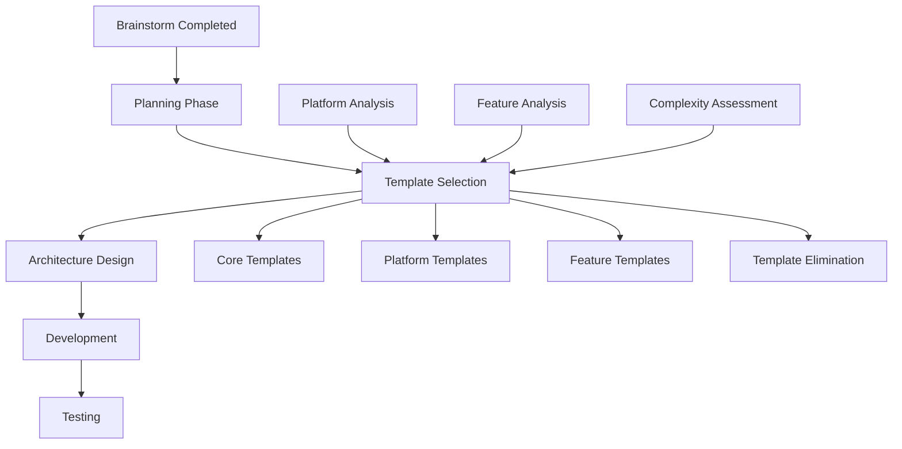

# Template Selection Integration Guide

## Tổng Quan

Tài liệu này hướng dẫn cách tích hợp quy trình Template Selection vào workflow phát triển dự án, giúp tối ưu hóa việc lựa chọn và loại bỏ các template phù hợp sau bước lập kế hoạch.

## Vị Trí Trong Quy Trình Tổng Thể



## Quy Trình Tích Hợp Chi Tiết

### Phase 1: Post-Planning Analysis

#### 1.1 Đọc Kết Quả Planning
- [ ] Xem xét file planning đã hoàn thành
- [ ] Xác định platform chính (Android/iOS/Web/Cross-platform)
- [ ] Phân tích độ phức tạp dự án (Simple/Medium/Complex)
- [ ] Liệt kê tính năng cốt lõi từ planning
- [ ] Đánh giá tech stack requirements

#### 1.2 Platform Detection
```yaml
platform_indicators:
  android:
    - "Android app"
    - "Google Play"
    - "Kotlin"
    - "Jetpack Compose"
  ios:
    - "iOS app"
    - "App Store"
    - "Swift"
    - "SwiftUI"
  web:
    - "Web application"
    - "Browser"
    - "React/Vue/Angular"
  cross_platform:
    - "Both Android and iOS"
    - "Flutter"
    - "React Native"
```

### Phase 2: Template Selection Matrix

#### 2.1 Core Templates (Always Required)
```yaml
core_templates:
  mandatory:
    - base-rules.mdc
    - development-rules.mdc
    - file-protection-rules.mdc
    - planning-workflow.mdc
    - template-selection-workflow.mdc
  
  reasoning: "Essential for all projects regardless of platform or complexity"
```

#### 2.2 Platform-Specific Selection

**Android Projects:**
```yaml
android_templates:
  required:
    - android-workflow.mdc
    - android-project-template.mdc
    - tdd-mobile-workflow.mdc
  
  conditional:
    - android-code-deduplication.mdc: "if team_size > 2"
    - android-aso-package-workflow.mdc: "if play_store_optimization_needed"
  
  excluded:
    - ios-workflow.mdc
    - ios-project-template.mdc
    - web-specific templates
```

**iOS Projects:**
```yaml
ios_templates:
  required:
    - ios-workflow.mdc
    - ios-project-template.mdc
    - tdd-mobile-workflow.mdc
  
  excluded:
    - android-workflow.mdc
    - android-project-template.mdc
    - web-specific templates
```

**Cross-Platform Projects:**
```yaml
cross_platform_templates:
  required:
    - mobile-utility-workflow.mdc
    - platform-workflow-selector.mdc
    - universal-code-deduplication.mdc
    - tdd-mobile-workflow.mdc
  
  conditional:
    - android-workflow.mdc: "if android_primary"
    - ios-workflow.mdc: "if ios_primary"
```

#### 2.3 Feature-Based Selection

```yaml
feature_templates:
  authentication:
    templates:
      - api-integration-rules.mdc
    condition: "has_user_authentication"
  
  database:
    templates:
      - database-management.mdc
      - resource-management.mdc
    condition: "complex_data_storage"
  
  api_integration:
    templates:
      - api-integration-rules.mdc
      - backend-rules-optimized.mdc
    condition: "external_api_integration"
  
  internationalization:
    templates:
      - i18n-rules.mdc
    condition: "multi_language_support"
  
  notifications:
    templates:
      - telegram-notification-workflow.mdc
    condition: "notification_system"
```

### Phase 3: Template Elimination

#### 3.1 Elimination Criteria
```markdown
## Template Elimination Checklist

### ❌ Eliminate If:
- [ ] Platform mismatch (iOS templates for Android project)
- [ ] Feature not in planning (notification templates without notification feature)
- [ ] Overcomplexity (advanced templates for simple projects)
- [ ] Team unfamiliarity (complex templates team can't maintain)
- [ ] Resource constraints (templates requiring additional tools/services)
- [ ] Redundancy (multiple templates serving same purpose)

### ⚠️ Consider Carefully:
- [ ] Future scalability needs
- [ ] Team learning curve
- [ ] Maintenance overhead
- [ ] Integration complexity
```

#### 3.2 Decision Matrix
```yaml
decision_factors:
  project_complexity:
    simple: "minimal_templates_only"
    medium: "core_plus_platform_templates"
    complex: "full_template_suite"
  
  team_size:
    solo: "individual_focused_templates"
    small_team: "collaboration_templates"
    large_team: "enterprise_templates"
  
  timeline:
    tight: "proven_templates_only"
    moderate: "standard_template_set"
    flexible: "experimental_templates_allowed"
```

### Phase 4: Documentation & Integration

#### 4.1 Template Selection Report
```markdown
# Template Selection Report - [Project Name]

## Selection Summary
- **Total Templates Evaluated**: [Number]
- **Templates Selected**: [Number]
- **Templates Excluded**: [Number]
- **Selection Date**: [Date]

## Selected Templates

### Core Templates
| Template | Reason | Impact |
|----------|--------|--------|
| base-rules.mdc | Foundation | High |
| development-rules.mdc | Code Quality | High |

### Platform Templates
| Template | Reason | Impact |
|----------|--------|--------|
| android-workflow.mdc | Android Development | High |

### Feature Templates
| Template | Reason | Impact |
|----------|--------|--------|
| api-integration-rules.mdc | External APIs | Medium |

## Excluded Templates

### Not Applicable
| Template | Reason for Exclusion |
|----------|---------------------|
| ios-workflow.mdc | Android-only project |

### Future Consideration
| Template | Condition for Addition |
|----------|----------------------|
| i18n-rules.mdc | When internationalization needed |

## Integration Plan

### Immediate (Sprint 1)
- [ ] Configure core templates
- [ ] Setup platform-specific workflows
- [ ] Initialize project structure

### Phase 2 (Sprint 2-3)
- [ ] Integrate feature templates
- [ ] Configure specialized workflows
- [ ] Setup advanced tooling

### Future Phases
- [ ] Review template effectiveness
- [ ] Add templates as needed
- [ ] Remove unused templates
```

#### 4.2 Workspace Configuration
```json
{
  "cursor.rules": {
    "selectedTemplates": [
      "base-rules.mdc",
      "development-rules.mdc",
      "android-workflow.mdc"
    ],
    "excludedTemplates": [
      "ios-workflow.mdc",
      "web-specific-templates"
    ],
    "conditionalTemplates": {
      "i18n-rules.mdc": "when_internationalization_needed"
    }
  }
}
```

## Best Practices

### Template Selection Principles

1. **Start Minimal**
   - Begin with core templates only
   - Add templates incrementally
   - Avoid over-engineering from start

2. **Platform-First**
   - Prioritize platform-specific templates
   - Ensure compatibility between templates
   - Consider cross-platform implications

3. **Feature-Driven**
   - Select templates based on actual features
   - Don't add templates "just in case"
   - Review feature-template mapping regularly

4. **Team-Centric**
   - Consider team expertise
   - Ensure templates are maintainable
   - Provide training for complex templates

### Common Pitfalls to Avoid

❌ **Over-Selection**
- Adding too many templates initially
- Including templates for future features
- Not considering maintenance overhead

❌ **Under-Selection**
- Skipping essential platform templates
- Ignoring code quality templates
- Missing critical workflow templates

❌ **Poor Documentation**
- Not recording selection rationale
- Missing exclusion reasons
- No integration timeline

✅ **Good Practices**
- Document every decision
- Regular template review
- Incremental addition
- Team consensus on selection

## Integration Checklist

### Pre-Selection
- [ ] Planning phase completed
- [ ] Platform identified
- [ ] Features documented
- [ ] Team capabilities assessed

### Selection Process
- [ ] Core templates identified
- [ ] Platform templates selected
- [ ] Feature templates evaluated
- [ ] Elimination criteria applied
- [ ] Decision matrix completed

### Post-Selection
- [ ] Template_Selection.md created
- [ ] Workspace configured
- [ ] Team notified
- [ ] Integration plan established
- [ ] Review schedule set

### Validation
- [ ] All selected templates compatible
- [ ] No conflicting rules
- [ ] Team trained on templates
- [ ] Documentation complete
- [ ] Ready for architecture phase

## Maintenance & Review

### Regular Review Schedule
- **Weekly**: Template usage assessment
- **Sprint End**: Template effectiveness review
- **Monthly**: Template selection optimization
- **Quarterly**: Complete template audit

### Review Questions
1. Are all selected templates being used?
2. Are there missing templates causing issues?
3. Do any templates conflict with each other?
4. Is the team comfortable with current templates?
5. Should any templates be added or removed?

### Update Process
1. Identify need for change
2. Evaluate impact of change
3. Update Template_Selection.md
4. Reconfigure workspace
5. Notify team of changes
6. Monitor effectiveness

Bằng cách tích hợp Template Selection vào quy trình planning, chúng ta đảm bảo rằng mỗi dự án sử dụng đúng bộ templates cần thiết, tránh phức tạp hóa không cần thiết và tối ưu hóa hiệu quả phát triển.