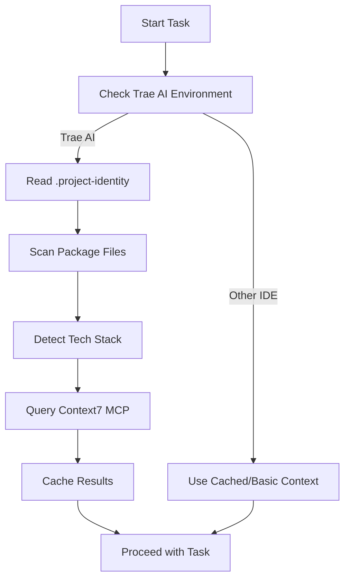

# Context7 Auto-Check Implementation Guide

## Tổng Quan

Workflow này được thiết kế để tự động kiểm tra và cập nhật context dự án mà không cần người dùng yêu cầu cụ thể. **Chỉ hoạt động trên Trae AI IDE** với Context7 MCP support.

### ⚠️ Điều Kiện Sử Dụng
- **BẮT BUỘC**: Phải sử dụng Trae AI IDE
- **BẮT BUỘC**: Context7 MCP server phải được cấu hình
- **Fallback**: Trên các IDE khác sẽ sử dụng cached context hoặc basic patterns

Mục tiêu là đảm bảo AI luôn có thông tin cập nhật về tech stack, best practices và patterns hiện tại khi có thể access Context7.

## Cách Hoạt Động

### 1. Automatic Context Discovery



### 2. Context Check Process

#### Phase 1: Project Analysis
- **File Scanning**: Tự động scan các file như `package.json`, `requirements.txt`, `pubspec.yaml`
- **Pattern Detection**: Phát hiện framework patterns trong code
- **Dependency Mapping**: Map dependencies với Context7 library IDs

#### Phase 2: Context7 Integration (Chỉ trên Trae AI)
- **Environment Check**: Xác nhận đang chạy trên Trae AI IDE
- **Library Resolution**: Sử dụng `resolve-library-id` để tìm exact library IDs
- **Documentation Fetch**: Lấy latest docs qua `get-library-docs`
- **Best Practices Sync**: Cập nhật coding standards và patterns
- **Fallback Handling**: Sử dụng cached context nếu không phải Trae AI

#### Phase 3: Context Application
- **Pattern Validation**: So sánh current code với best practices
- **Suggestion Generation**: Đề xuất improvements dựa trên context
- **Documentation Update**: Cập nhật project docs nếu cần

## Implementation Examples

### Example 1: React Project Context Check

```javascript
// Detected in package.json:
{
  "dependencies": {
    "react": "^18.2.0",
    "react-router-dom": "^6.8.0",
    "@tanstack/react-query": "^4.24.0"
  }
}

// Auto Context7 queries:
// 1. resolve-library-id: "react"
// 2. resolve-library-id: "react-router"
// 3. resolve-library-id: "tanstack react-query"

// Result: Updated context với latest React 18 patterns,
// Router v6 best practices, và TanStack Query v4 usage
```

### Example 2: Flutter Project Context Check

```yaml
# Detected in pubspec.yaml:
dependencies:
  flutter:
    sdk: flutter
  riverpod: ^2.3.0
  go_router: ^6.5.0
  dio: ^5.0.0

# Auto Context7 queries:
# 1. resolve-library-id: "flutter"
# 2. resolve-library-id: "riverpod"
# 3. resolve-library-id: "go_router"
# 4. resolve-library-id: "dio"

# Result: Context với Flutter 3.x patterns,
# Riverpod 2.x state management, GoRouter navigation
```

## Memory Bank Integration

### Context Session File Structure

```markdown
# Context Session: 2024-01-15

## Detected Tech Stack
- **Frontend**: React 18.2.0, TypeScript 5.0
- **State Management**: Zustand 4.3.0
- **Routing**: React Router 6.8.0
- **Styling**: Tailwind CSS 3.2.0
- **Testing**: Jest 29.0, React Testing Library

## Context7 Queries Performed
1. ✅ React → /facebook/react (Trust: 10, Snippets: 15000+)
2. ✅ Zustand → /pmndrs/zustand (Trust: 9.8, Snippets: 500+)
3. ✅ React Router → /remix-run/react-router (Trust: 9.9)
4. ✅ Tailwind → /tailwindlabs/tailwindcss (Trust: 10)

## Context Updates Applied
- Updated React patterns to use React 18 features
- Applied Zustand 4.x best practices
- Integrated React Router 6 data loading patterns
- Updated Tailwind utility-first approach

## Recommendations Generated
- Consider upgrading to React Router 6.9 for better data APIs
- Implement React 18 Suspense boundaries
- Use Zustand devtools for better debugging
- Apply Tailwind container queries for responsive design

## Cache Status
- **Last Updated**: 2024-01-15 10:30:00
- **Cache Expiry**: 2024-01-16 10:30:00
- **Libraries Cached**: 4/4
- **Context Freshness**: ✅ Fresh
```

## Trigger Scenarios

### Automatic Triggers

1. **New Session Start**
   ```
   User: "Tôi muốn thêm tính năng authentication"
   → Auto context check cho auth libraries
   → Suggest best practices cho current stack
   ```

2. **Dependency Change Detection**
   ```
   Detected: package.json modified
   → Re-scan dependencies
   → Update context cho new/updated libraries
   → Validate compatibility
   ```

3. **Error-Triggered Context Refresh**
   ```
   Error: "useNavigate is not defined"
   → Check React Router context
   → Update navigation patterns
   → Suggest correct imports
   ```

### Manual Triggers

1. **Explicit Context Refresh**
   ```
   User: "Hãy cập nhật context cho dự án này"
   → Force refresh all cached context
   → Re-query Context7 cho all libraries
   ```

2. **Pre-Refactoring Context Check**
   ```
   User: "Tôi muốn refactor state management"
   → Deep context check cho state management options
   → Compare current vs recommended patterns
   ```

## Performance Optimizations

### Caching Strategy

```javascript
// Context Cache Structure
{
  "react": {
    "libraryId": "/facebook/react",
    "version": "18.2.0",
    "lastUpdated": "2024-01-15T10:30:00Z",
    "expiresAt": "2024-01-16T10:30:00Z",
    "patterns": [...],
    "bestPractices": [...]
  },
  "zustand": {
    "libraryId": "/pmndrs/zustand",
    "version": "4.3.0",
    "lastUpdated": "2024-01-15T10:30:00Z",
    "expiresAt": "2024-01-16T10:30:00Z",
    "patterns": [...]
  }
}
```

### Batch Processing

```javascript
// Instead of individual calls:
// resolve-library-id: "react"
// resolve-library-id: "zustand"
// resolve-library-id: "react-router"

// Use batch processing:
const libraries = ["react", "zustand", "react-router"];
const contexts = await Promise.all(
  libraries.map(lib => resolveLibraryId(lib))
);
```

## Error Handling & Fallbacks

### Network Issues
```javascript
try {
  const context = await getLibraryDocs(libraryId);
  updateContext(context);
} catch (error) {
  console.warn('Context7 unavailable, using cached context');
  const cachedContext = getCachedContext(libraryId);
  if (cachedContext && !isExpired(cachedContext)) {
    useContext(cachedContext);
  } else {
    // Fallback to basic patterns
    useBasicPatterns(libraryId);
  }
}
```

### API Rate Limiting
```javascript
const rateLimiter = {
  calls: 0,
  resetTime: Date.now() + 60000, // 1 minute
  maxCalls: 10,
  
  canMakeCall() {
    if (Date.now() > this.resetTime) {
      this.calls = 0;
      this.resetTime = Date.now() + 60000;
    }
    return this.calls < this.maxCalls;
  }
};
```

## Integration với Existing Workflows

### Brainstorm Workflow Enhancement
```markdown
# Enhanced Brainstorm với Context7

## Before (Old Process)
1. User provides idea
2. AI brainstorms based on general knowledge
3. Suggests generic tech stack

## After (Context-Aware Process)
1. User provides idea
2. **AUTO**: Check current project context
3. **AUTO**: Query Context7 for relevant libraries
4. AI brainstorms với up-to-date knowledge
5. Suggests context-aware tech stack
6. Provides current best practices
```

### Planning Workflow Enhancement
```markdown
# Enhanced Planning với Context7

## Context-Informed Planning
1. **AUTO**: Analyze existing codebase context
2. **AUTO**: Check compatibility với planned features
3. **AUTO**: Suggest optimal implementation patterns
4. Create detailed plan với current best practices
5. Include migration steps nếu cần updates
```

## Monitoring & Analytics

### Success Metrics
- **Context Freshness**: % of libraries với up-to-date context
- **Error Reduction**: Decrease in context-related errors
- **Pattern Compliance**: % of code following current best practices
- **Developer Satisfaction**: Feedback on context accuracy

### Monitoring Dashboard
```markdown
# Context7 Workflow Analytics

## Daily Stats (2024-01-15)
- **Context Checks**: 45
- **Cache Hits**: 32 (71%)
- **API Calls**: 13
- **Errors**: 2 (network timeout)
- **Context Updates**: 8

## Library Coverage
- **React**: ✅ Fresh (updated 2h ago)
- **Vue**: ✅ Fresh (updated 4h ago)
- **Angular**: ⚠️ Stale (updated 1d ago)
- **Flutter**: ✅ Fresh (updated 1h ago)

## Performance
- **Avg Context Check Time**: 1.2s
- **Cache Hit Rate**: 71%
- **API Success Rate**: 94%
```

## Troubleshooting

### Common Issues

1. **Context7 API Unavailable**
   - **Symptom**: Network errors khi query libraries
   - **Solution**: Use cached context, fallback to basic patterns
   - **Prevention**: Implement robust caching strategy

2. **Library Not Found**
   - **Symptom**: resolve-library-id returns no results
   - **Solution**: Use generic patterns, manual context input
   - **Prevention**: Maintain fallback library mappings

3. **Context Cache Corruption**
   - **Symptom**: Inconsistent or outdated patterns
   - **Solution**: Clear cache, force refresh
   - **Prevention**: Implement cache validation

### Debug Commands

```bash
# Check context cache status
cat memory_bank/context_session.md

# Force context refresh
rm memory_bank/context_session.md
# Next task will trigger full context refresh

# View context history
ls memory_bank/context_history/

# Check library cache
ls memory_bank/library_cache/
```

## Best Practices

### For AI Assistants
1. **Always check context** trước khi suggest patterns
2. **Use cached context** khi available và fresh
3. **Graceful degradation** khi Context7 unavailable
4. **Log context decisions** for debugging
5. **Update context** khi detect changes

### For Developers
1. **Keep dependencies updated** trong package files
2. **Review context suggestions** before applying
3. **Provide feedback** on context accuracy
4. **Monitor context freshness** regularly
5. **Clear cache** khi experiencing issues

## Future Enhancements

### Planned Features
- **Smart Context Prediction**: Predict needed libraries based on task
- **Context Diff Visualization**: Show changes in context over time
- **Team Context Sharing**: Share context across team members
- **Context-Aware Code Generation**: Generate code using current patterns
- **Automated Context Testing**: Test generated code against context

### Integration Opportunities
- **IDE Extensions**: Real-time context checking trong editor
- **CI/CD Integration**: Context validation trong build pipeline
- **Documentation Generation**: Auto-generate docs from context
- **Code Review**: Context-aware code review suggestions

Workflow này sẽ giúp đảm bảo rằng AI luôn có context cập nhật về dự án mà không cần người dùng phải yêu cầu cụ thể, từ đó cải thiện chất lượng suggestions và giảm thiểu errors do outdated knowledge.